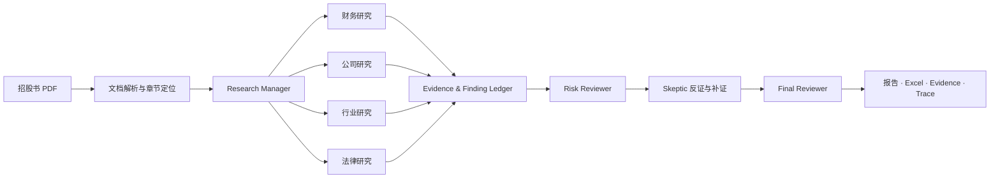

# HK IPO Intelligence Desk

> 将数百页港股招股书转化为可追溯、可复核的投研底稿与尽调报告。


**HK IPO Intelligence Desk** 是面向一级市场研究场景的港股 IPO 尽调工作台。输入公司名称与招股书 PDF，系统自动完成文档解析、财务重建、公司与行业研究、法律风险核查、交叉质疑和报告生成，并为关键结论保留 PDF 页码、计算过程或公开来源。

它的核心目标不是让模型“读完后给一个答案”，而是把 IPO 研究拆成一条可审计的生产流程：**数字交给确定性程序，判断交给专业 Agent，结论必须回到证据。**

[产品能力](#产品能力) · [工作流程](#工作流程) · [真实案例](#真实案例) · [快速开始](#快速开始) · [交付产物](#交付产物) · [系统设计](#系统设计)

## 从招股书到投委会材料

| 输入 | 系统处理 | 交付 |
|---|---|---|
| 公司名称、港股招股书 PDF、可选公开资料 | 文档定位、三表重建、指标计算、四路研究、风险规则、反证复核 | Markdown 尽调报告、Excel 财务底稿、Evidence Ledger、Agent Trace |

系统适合用于招股书初筛、研究底稿准备和投委会前核查。研究人员可以从最终结论反查到 Finding，再定位到原始页码、计算依据或外部来源，减少长文档研究中的数字误读、引用丢失和模型幻觉。

## 产品能力

### 招股书结构化解析

- 按页解析 PDF，定位业务、财务、风险、股权与法律章节。
- 重建利润表、资产负债表和现金流量表，并区分发行人、子公司及被收购主体。
- 统一登记事实、表格、指标和来源，为后续研究提供稳定数据层。

### 财务分析与法证检查

- 计算收入、毛利率、现金转化、应收账款、存货等核心指标。
- 通过 20 条确定性规则检查增长质量、周转异常和现金流风险。
- 财务数字只能来自已登记数据或计算 Evidence，模型不负责创造或重算数字。

### Multi-Agent 专业研究

- Research Manager 根据公司与文档上下文拆解研究任务。
- Financial、Company、Industry、Legal 四类 Expert Agents 分别形成结构化 Findings。
- Risk Reviewer 汇总跨领域风险，Skeptic 对关键结论发起反证挑战，Final Reviewer 完成终审。

### Evidence-grounded 结论

- 每条 Finding 关联 PDF 页码、计算过程或已核验网页来源。
- 缺少证据时返回 `unable_to_verify`、`insufficient_evidence` 或 `manual_required`，不使用模型补写事实。
- 搜索摘要仅用于发现候选来源，抓取并完成主体匹配后才能进入 Evidence Ledger。

### 可交付的研究工作台

- 在 Streamlit 工作台查看投资结论、研究覆盖、风险信号、Agent 协作状态与报告。
- 同时生成适合阅读的 Markdown 报告和适合复核的 Excel/JSON 底稿。
- 支持离线确定性流程，也支持通过 OpenAI-compatible API 接入本地或云端模型。

## 产品界面


> 工作台界面预览。画面使用脱敏展示数据；仓库内可公开复核的真实流水线统计与评测结果见下方“真实案例”。

## 工作流程



Agent 之间不传递自由文本“聊天记录”，而是通过 Pydantic 定义的 Research Task、Evidence、Finding、Challenge 和 Review Result 协作。长文档先被切分为可定位的事实与材料包，再按章节分配上下文预算，避免将整份招股书一次性塞入模型。

## 真实案例

项目已在一份 **504 页港股申请版本**上完成离线流程与本地 Qwen3.5-4B / vLLM 流程的端到端回归。公开仓库仅保留脱敏统计与评测文件，不包含原始招股书及内部资料。

| 处理结果 | 离线确定性流程 | Qwen3.5-4B / vLLM |
|---|---:|---:|
| 解析页数 | 504 | 504 |
| 重建财务报表 | 13 | 13 |
| 财务事实 / 指标 | 462 / 32 | 462 / 32 |
| 研究证据 / Findings | 59 / 14 | 85 / 20 |
| 模型生成附注 | 0 | 33 |
| 法证规则命中 | 4 / 20 | 4 / 20 |

在该 development case 的人工标签上，系统复核结果为：**8/8 核心指标匹配、6/6 风险标签命中、证据页定位准确率 100%**。这些数字用于说明单案例回归的可复现性，不代表跨公司泛化准确率。

查看脱敏产物与评分：[`examples/hosonsoft/`](examples/hosonsoft/)

## 快速开始

### 1. 安装

推荐使用 Python 3.10–3.12：

```bash
python -m venv .venv
# Windows: .venv\Scripts\activate
# Linux/macOS: source .venv/bin/activate
pip install -e ".[dev,ui,search]"
```

复制 `.env.example` 为 `.env`。真实 PDF、API Key、数据库和运行结果均已被 Git 忽略。

### 2. 运行离线流程

离线模式不调用大模型，适合验证 PDF 解析、财务计算、规则和交付链路：

```bash
python main.py --pdf "data/uploads/prospectus.pdf" --company "示例公司" --llm-mode off
```

### 3. 接入模型

项目支持任意 OpenAI-compatible 服务，包括本地 vLLM 与兼容接口的云模型：

```env
OPENAI_COMPATIBLE_API_KEY=your-key
OPENAI_COMPATIBLE_BASE_URL=http://127.0.0.1:8000/v1
OPENAI_COMPATIBLE_MODEL=qwen-local
```

```bash
python main.py --pdf "data/uploads/prospectus.pdf" --company "示例公司" --llm-mode auto
```

`auto` 会在模型不可用时降级到确定性流程；`on` 要求模型配置完整。

### 4. 打开工作台

```bash
streamlit run app.py --server.address 0.0.0.0 --server.port 8501
```

Windows 也可以直接运行 `run_demo.bat` 浏览脱敏演示界面。

## 交付产物

每次任务按 `job_id` 隔离，稳定交付入口包括：

```text
data/output/<job_id>/
├── IPO_Due_Diligence_Report.md     # 尽调报告
├── IPO_Due_Diligence_Report.xlsx   # 财务与研究底稿
├── evidence.json                   # 证据账本
├── agent_trace.json                # Agent 调用与状态轨迹
└── delivery_manifest.json          # 交付清单与完整性状态
```

阶段性 JSON 同时保留 Manager 任务、各领域 Findings、Reviewer 意见、补证记录和报告校验结果，便于问题定位与人工复核。

## 系统设计

```text
src/ipo_financial_agent/
├── agents/       # Financial / Company / Industry / Legal Agents
├── document/     # PDF 页面、章节与主题定位
├── extraction/   # 表格与财务事实抽取
├── finance/      # 指标计算、取证与风险规则
├── ledger/       # Evidence / Finding 登记
├── research/     # Manager Context、任务与实体注册
├── review/       # Risk Reviewer、Skeptic 与最终综合
├── report/       # 材料包、章节生成、校验与组装
├── runtime/      # 工具预算、超时、上下文预检与调用轨迹
├── evaluation/   # 标签、预测与评测
└── schemas/      # Pydantic 数据契约
```

关键工程约束：

- **Deterministic first**：解析、计算、风险规则和引用校验由代码执行。
- **Evidence first**：结论必须关联证据；证据不足时显式暴露缺口。
- **Bounded context**：按任务和章节构造上下文，调用前预估中英文混合 token 并为输出预留窗口。
- **Graceful degradation**：单个 Agent、搜索或评审节点失败时记录状态并局部降级，不中断整条交付链路。
- **Revision gate**：候选修订只有在复审分数严格提高时才会被采纳。

## 测试与评测

```bash
python -m compileall -q src main.py app.py
python -m pytest -q
```

当前版本基线为 **141 passed**，覆盖文档定位、主体识别、三表重建、指标与法证规则、Agent 工具预算、上下文预检、Reviewer/Skeptic 闭环、Evidence 引用、报告交付和评测流程。

评测工具：

```bash
python scripts/eval_prepare_case.py --help
python scripts/eval_build_prediction.py --help
python scripts/eval_score.py --help
```

## 使用边界

扫描型 PDF、复杂跨页表格以及受限外部网页仍可能需要人工复核。本项目用于研究辅助与工程验证，不构成投资建议、审计意见或法律意见，也不包含自动交易功能。

## 开发说明

项目采用 AI-assisted / Vibe Coding 工作流。作者负责产品需求、系统架构、金融规则、测试标准与结果验收，Codex 用于实现、重构与文档协作；所有生成代码均通过结构化契约、自动化测试和人工案例复核约束。

## License

MIT License。使用招股书、网页和行业资料时，请遵守原始来源的版权、访问和使用条款。
