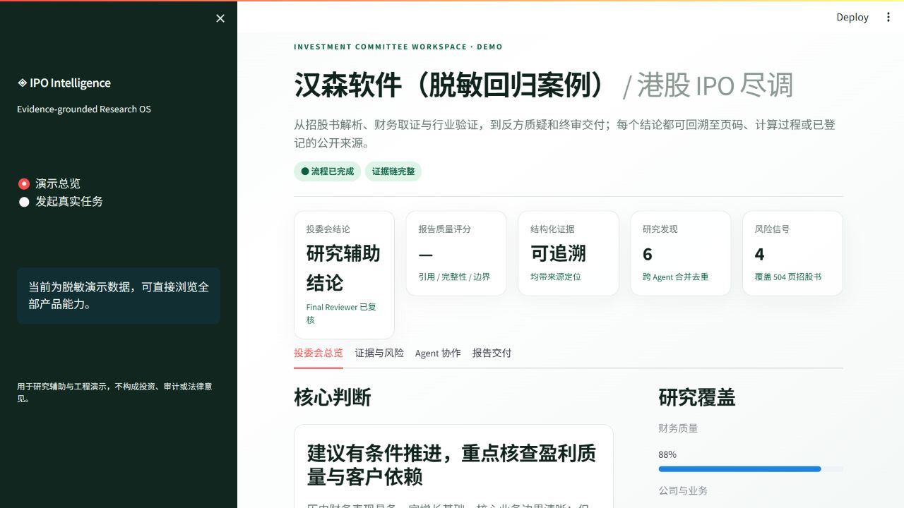
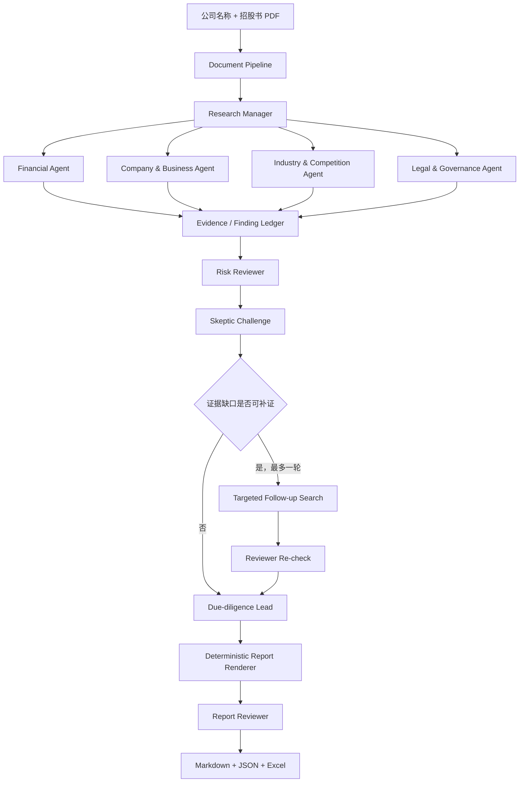

# IPO Research Agent

[](https://github.com/alexa0030/IPO-Multi-Agent/actions/workflows/ci.yml)


面向港股 IPO 招股书的 **Evidence-grounded Multi-Agent 尽调平台**。它不是一个“上传 PDF 后聊天”的壳：系统将确定性财务计算、公司/行业/法律研究、证据账本、反证复核与报告终审拆成可审计的工程流水线。



## 60 秒了解项目

| 面试官最关心的问题 | 当前实现 |
|---|---|
| 输入什么？ | 公司名称 + 港股招股书 PDF；公开研究可选 |
| 解决什么？ | 数百页招股书中的财务重建、业务/行业/法律核查与跨结论复核 |
| 为什么不是普通 RAG？ | 数字由 Python 计算；Finding 必须引用 Evidence；缺证时显式失败而非补写 |
| 输出什么？ | Markdown 尽调报告、Excel 底稿、Evidence Ledger、Agent Trace、JSON/SQLite |
| 做到什么程度？ | 504 页真实案例回归；13 张报表、468 条事实、29 项指标、20 条法证规则 |
| 如何证明质量？ | 135 项自动化测试；4 个版本化评测案例清单，其中 1 个已完成人工 gold labels |

> **立即看界面：** 运行 `run_demo.bat`（Windows）或 `streamlit run app.py`。
> 演示模式无需 PDF、模型或 API Key；上传招股书后，同一工作台调用完整后端。

> 当前定位：v0.9 Engineering MVP。项目用于研究辅助、工程演示和多 Agent 金融文档分析实验，不构成投资、法律或审计意见。

## 核心原则

- **确定性优先**：PDF 抽取、三表重建、指标计算、风险规则、引用校验由代码完成；Qwen 负责解释和组织语言。
- **Evidence-first**：Finding 必须引用 PDF 页码、计算证据或已抓取并登记的网页原文；搜索摘要只能作为待核实线索。
- **结构化协作**：Agent 之间通过 Pydantic Schema、Research Task、Finding、Evidence、Review Topic 和 Report Material Pack 传递结果。
- **正负面平衡**：报告同时保留业务事实、优势、风险、混合判断、证据缺口和后续核查问题。
- **失败可降级**：Manager、搜索、Topic Reviewer 或章节生成失败时，仅降级当前节点，并在产物中保留状态和错误。
- **隐私安全**：真实 PDF、API Key、数据库和运行输出不进入 Git；仓库只保留代码、模板和示例配置。

## 工作流



## Agent 职责

| 模块 | 主要职责 |
|---|---|
| Research Manager | 基于只读 Manager Context 生成研究任务；校验失败时显式降级到固定任务 |
| Financial Agent | 三表、指标、现金转化、应收/存货匹配和财务风险规则分析 |
| Company & Business Agent | 公司历史、产品、商业模式、客户、供应商、技术和增长计划 |
| Industry & Competition Agent | Web-first 行业规模、产业链、竞争格局、壁垒、政策和周期验证 |
| Legal & Governance Agent | 实控人、股权、子公司、关联方、诉讼、处罚、执行和治理事项 |
| Risk Reviewer | 跨 Agent 汇总风险、矛盾和投资核查问题，并构建风险矩阵 |
| Skeptic | 对关键结论提出反证挑战；只在必要时触发一次定向补证 |
| Due-diligence Lead | 综合历史财务质量、持续盈利能力和重大负面事项形成结论 |
| Report Pipeline | 确定性生成分析师口径报告并执行引用、章节和完整性终审 |

## 证据和数据契约

核心对象位于 `src/ipo_financial_agent/schemas/`：

- `Evidence`：PDF 页码、URL、发布主体、日期、摘要或计算过程。
- `Finding`：研究陈述、解释、性质（`strength`/`risk`/`mixed`/`neutral_observation`）、置信度和 Evidence 引用。
- `ResearchTask` / `ResearchQuestion`：任务边界、稳定 `question_id`、`research_topic` 和期望证据。
- `TopicReviewResult`：跨 Agent 一致性、正面因素、负面因素、Evidence Gap 和补充核查。
- `FinalSynthesis`：`pass`、`conditional_pass`、`needs_follow_up`、`high_risk` 或 `failed` 等确定性状态。
- `ReportMaterialPack`：报告章节可访问的事实、Finding、证据和数字边界。

财务数字只能来自已登记的表格、指标和计算 Evidence；模型不得创造、修改或重新计算数字。无法确认的事项使用 `unable_to_verify`、`insufficient_evidence` 或 `manual_required`。

## 项目结构

```text
ipo_product_closure/
├── main.py                         # CLI 入口
├── app.py                          # Streamlit 入口
├── pyproject.toml
├── requirements.txt
├── .env.example                    # 脱敏配置模板
├── scripts/                        # 审计、流水线和 smoke 脚本
├── src/ipo_financial_agent/
│   ├── agents/                     # 各专业 Agent
│   ├── document/                   # PDF 页面、章节和主题定位
│   ├── extraction/                 # 原始表格与财务抽取
│   ├── finance/                    # 指标、取证和风险规则
│   ├── ledger/                     # Evidence/Finding 登记
│   ├── evaluation/                 # 评测样本、预测与指标计算
│   ├── runtime/                    # Agent 工具预算、超时和可审计调用轨迹
│   ├── research/                   # Manager Context、任务和实体注册
│   ├── review/                     # Topic Reviewer 与 Final Synthesis
│   ├── report/                     # 材料包、章节路由、Validator、组装
│   ├── schemas/                    # Pydantic 数据契约
│   ├── tools/search/               # Tavily/DDGS/网页抓取抽象
│   └── workflow/                   # 各阶段流水线
├── data/                           # 运行时目录（真实数据不提交）
├── docs/                           # 架构和 PRD 文档
└── tests/
```

## 快速开始

推荐 Python 3.10–3.12：

```bash
python -m venv .venv
# Windows: .venv\Scripts\activate
# Linux/macOS: source .venv/bin/activate
pip install -e ".[dev,ui,search]"
copy .env.example .env       # Windows
```

离线运行（不调用模型）：

```bash
python main.py --pdf "data/uploads/prospectus.pdf" --company "示例公司" --llm-mode off
```

连接本地 Qwen/vLLM（OpenAI-compatible API）：

```env
OPENAI_COMPATIBLE_API_KEY=local-key
OPENAI_COMPATIBLE_BASE_URL=http://127.0.0.1:8000/v1
OPENAI_COMPATIBLE_MODEL=qwen-local
```

然后运行：

```bash
python main.py --pdf "data/uploads/prospectus.pdf" --company "示例公司" --llm-mode auto
streamlit run app.py --server.address 0.0.0.0 --server.port 8501
```

`auto` 在模型不可用时安全降级；`on` 要求模型配置完整。项目不绑定 Qwen API，部署时可连接服务器本地 vLLM，也可连接任何兼容 OpenAI API 的模型服务。

## 搜索配置

```env
IPO_SEARCH_PROVIDER=auto       # auto / tavily / ddgs / off
IPO_SEARCH_MAX_QUERIES=12
IPO_SEARCH_MAX_FETCHED_SOURCES=30
IPO_LEGAL_SEARCH_MAX_QUERIES=6
IPO_LEGAL_ENTITY_MAX_QUERIES=10
TAVILY_API_KEY=
```

行业检索覆盖市场、竞争者、下游需求、产业链、技术标准、可比公司、出口与政策；法律检索使用独立且更小的预算。搜索摘要仅用于发现候选来源。系统会尝试抓取原始网页、进行来源和主体匹配，再登记为正式 Evidence；没有可用来源或搜索超时时，当前 Agent 会显式降级，不会中止整条工作流。

## 输出

每次运行按 `job_id` 隔离：

```text
data/output/<job_id>/
├── stage_manager/
├── stage_financial/
├── stage_company/
├── stage_industry/
├── stage_legal/
├── stage_report_materials/
├── stage_final_reviewer/
├── stage_report/
│   ├── section_materials.json
│   ├── generated_sections.json
│   ├── section_validations.json
│   ├── evidence_appendix.json
│   ├── final_report.json
│   └── final_report.md
└── full_research_run_result.json
```

稳定交付入口同时包含：

```text
data/output/<job_id>/
├── IPO_Due_Diligence_Report.md
├── IPO_Due_Diligence_Report.xlsx
├── evidence.json
├── agent_trace.json
└── delivery_manifest.json
```

财务报表按 `reporting_entity` 区分发行人、子公司及被收购主体，指标和报告主表均优先使用发行人口径，避免跨主体混算。

中间 JSON 是可审计交付物，可用于复核 Agent 状态、问题覆盖、Evidence 链和降级原因。真实招股书、数据库、`.env` 和生成报告属于本地运行数据，默认由 `.gitignore` 排除。

## 验证

```bash
python -m compileall -q src main.py app.py
python -m pytest -q
```

当前回归基线为 **135 passed**。测试覆盖文档定位、主体识别、三表与指标、财务规则、Research Ledger、Agent 工具预算与降级、Company/Industry/Legal 阶段、Reviewer + Skeptic 闭环、Evidence 引用、评测框架和 Markdown/Excel 交付。

评测脚本：

```bash
python scripts/eval_prepare_case.py --help
python scripts/eval_build_prediction.py --help
python scripts/eval_score.py --help
```

## 已知边界

- 扫描型 PDF、复杂跨页表格和 OCR 仍可能需要人工复核。
- 外部网站可能有反爬、登录、地区限制或内容变更。
- Legal Agent 是研究辅助工具，不能替代正式法律尽调。
- 当前主线面向上市前公司尽调，不包含上市后行情预警和自动交易。
- 运行结果不构成投资建议、估值结论、审计意见或法律意见。

## Roadmap

- 多公司、多行业回归和更完善的质量指标
- 断点恢复、缓存、失败重试和任务队列
- Evidence 点击定位、人工 Review 工作台
- 第二轮补证和 DOCX/PDF 报告导出
- 并发运行、成本/耗时统计和生产权限控制
- 上市后公告监控与持续风险更新

## License

建议使用 MIT License。使用招股书、网页和行业资料时，请遵守原始来源的版权、访问和使用条款。
