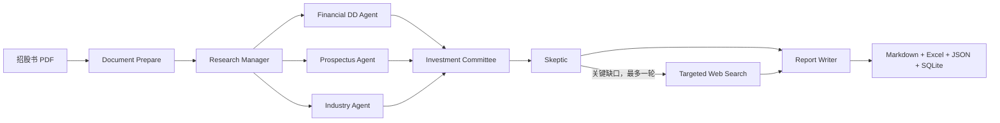

# HK IPO Due Diligence Agent

面向港股 IPO 的证据驱动多 Agent 尽调系统。输入公司名和招股书 PDF，输出带页码引用、计算底稿、风险挑战和未解决问题的 Markdown 投资报告。

它不是“让大模型总结 PDF”：财务数字由 Python 提取和计算，Agent 只在证据账本上形成结论；没有真实搜索结果时，系统会保留问题，而不是生成模拟新闻或来源。

## 为什么做这个项目

港股招股书通常有数百页。投资人员需要同时处理公司业务、财务质量、行业竞争、监管信息和风险反证，并能快速回到原文复核。本项目把这套工作拆成可审计的研究闭环：

1. 保留 PDF 原页和原表；
2. 专长 Agent 只提交“证据 + 结论 + 待核实问题”；
3. 投资委员会交叉检查冲突；
4. Skeptic 选择最多三项关键缺口，触发最多一轮定向补证；
5. 报告逐条展示证据 ID、页码或 URL。

## 架构



核心数据契约：

- `Evidence`：来源类型、原文、PDF 页码或 URL、发布日期、置信度；
- `Finding`：问题、结论、引用的 Evidence ID、证据强度、风险和待核实项；
- `Challenge`：Skeptic 发给指定 Agent 的补证请求；
- `Research Ledger`：全流程追加型证据账本，防止 Agent 无来源地改写事实。

## 已实现能力

- 逐页提取文本和原始表格，保留物理页码；
- 自动定位三大财务报表和重点业务章节；
- 统一财务事实标签，但不修改报表原始科目；
- Python 计算增长率、毛利率、净利率、费用率、现金转换、流动比率等指标；
- 6 条基础风险规则和 20 条财务法证规则；
- 公司业务、财务、行业三个研究分支及跨 Agent 冲突检查；
- Skeptic 挑战路由和单轮定向补证，避免无界 Agent 循环；
- Tavily 可选联网检索，优先标记港交所、证监会等官方来源；
- Markdown 投资报告、Excel 财务底稿、JSON 中间产物和 SQLite 存档；
- OpenAI-compatible 模型接口，支持本地 vLLM；
- 无模型、无搜索密钥时仍可离线运行，且不伪造外部信息。

## 快速开始

建议 Python 3.10–3.12。

```bash
python -m venv .venv
source .venv/bin/activate
pip install -e .
cp .env.example .env
```

Windows 激活命令为 `.venv\Scripts\activate`。

离线运行：

```bash
python main.py \
  --pdf "data/uploads/prospectus.pdf" \
  --company "深圳市汉森软件股份有限公司" \
  --llm-mode off
```

配置 OpenAI-compatible 模型后，将 `--llm-mode` 改为 `auto` 或 `on`：

```env
OPENAI_COMPATIBLE_API_KEY=your_key
OPENAI_COMPATIBLE_BASE_URL=http://127.0.0.1:8000/v1
OPENAI_COMPATIBLE_MODEL=your_model
TAVILY_API_KEY=your_tavily_key
```

`auto` 在模型可用时调用模型，否则安全降级；`on` 在配置缺失时直接报错；`off` 不调用模型。

## 输出

```text
data/extracted/<document_id>/
├── pages.json
├── raw_statements.json
├── financial_kb.json
├── metrics.json
├── forensic_findings.json
├── research_ledger.json
├── agent_messages.json
└── run_summary.json

data/output/
├── <document_id>_ipo_research_report.md
├── <document_id>_financial_report.md
└── <document_id>_financial_workbook.xlsx
```

最终 Markdown 覆盖项目摘要、公司与股权、业务产品、行业竞争、财务表现、投资逻辑、风险、Skeptic Challenges 和证据索引。投资结论与未解决问题分开呈现。

## 可复现实例

在一份 504 页港股申请版本上，以离线模式完成端到端回归：提取 13 张报表、468 条财务事实、29 个指标，执行 20 条法证规则并生成带页码证据的 Markdown 报告。该数字是当前样本文档的回归结果，不代表所有 PDF 的通用准确率。

运行测试：

```bash
python -m pytest -q
```

当前测试覆盖证据校验、页面选择、财务指标、法证规则、报告渲染、搜索完整性和 Skeptic 路由。

## 可信度与边界

- `pages.json` 是原始中间底稿，Excel 主表保留原始科目；
- PDF 证据必须引用实际输入页，外部证据必须有真实 URL；
- 财务指标由确定性代码计算，不交给模型心算；
- 规则命中是调查线索，不等同于审计结论；
- 扫描版 PDF 需要先 OCR，复杂无框表仍可能需要人工复核；
- 联网搜索只补充公开信息，不能替代监管、法律和财务专业意见；
- 正式投资决策前必须由分析师复核关键数字、口径、期间和引用。

## Roadmap

- 招股书 OCR 与版面模型回退；
- 港交所公告、证监会、公司注册处等官方数据源适配器；
- 可复现的多公司评测集和引用准确率指标；
- 人工审核、批注和报告版本差异；
- 估值可比公司与情景分析模块。

更多设计说明见 `docs/architecture.md` 和 `docs/competition_and_resume.md`。
