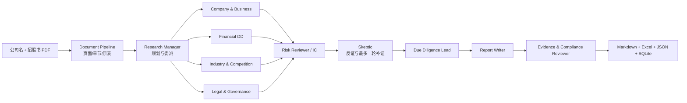

# HK IPO Due Diligence Multi-Agent

面向港股 IPO 的证据驱动多 Agent 公司尽调系统。输入公司名称与招股书 PDF，系统模拟一支投资团队，输出公司与股权、业务与商业模式、行业竞争、三大财务报表、盈利质量、法务治理、公开负面线索、交叉质疑和补充尽调清单。

本项目不是“让一个大模型总结 PDF”。PDF 抽取、财务计算和证据校验由确定性代码完成；Agent 在统一 Research Ledger 上协作，任何结论都必须回到招股书页码、计算底稿或真实 URL。证据不足时保留问题，不生成模拟新闻或数字。

## 运行闭环



九个公开角色及其可审计交接：

| 角色 | 核心职责 | 主要产物 |
|---|---|---|
| ResearchManager | 将“过去/现在有没有钱、未来会不会有钱、有没有重大负面”拆成任务 | `ResearchPlan` |
| CompanyBusinessAgent | 股权、产品、技术路线、商业模式、客户供应商、管理层 | `ProspectusAnalysis` |
| FinancialAgent | 三表抽取、指标计算、异常解释、财务取证 | `FinancialAnalysis` |
| IndustryAgent | 行业空间、上下游、竞争位置、护城河、增长瓶颈与公开搜索 | `IndustryAnalysis` |
| LegalGovernanceAgent | 实控人、关联交易、诉讼处罚、许可与治理线索 | `LegalGovernanceAnalysis` |
| RiskReviewer + Skeptic | 跨 Agent 对照、反方质疑、最多三项关键补证 | `RiskReview + Challenges` |
| DueDiligenceLead | 汇总历史财务质量、未来盈利能力与重大风险 | `DueDiligenceConclusion` |
| ReportWriter | 只基于已验证状态装配 Markdown，不改写长财务表 | `Markdown report` |
| EvidenceComplianceReviewer | 检查必备章节、三表、引用、越界内容与无依据结论 | `ReportReview` |

LangGraph 在安装时并行执行四个专业分支；没有 LangGraph 时使用相同数据契约顺序执行。Skeptic 最多触发一轮补证，避免 Agent 无限循环。

## 已实现能力

- 保留 PDF 原文件、物理页码、逐页文本与原始表格，不修改输入 PDF；
- 自动定位资产负债表、利润表、现金流量表及权益变动表；
- 最终 Markdown 直接展示三大报表原表，并同时导出完整 Excel、JSON、SQLite；
- Python 计算收入增长、毛利率、净利率、费用率、现金转换、流动比率等指标；
- 6 条基础风险规则与 20 条财务法证规则，规则命中只视为调查线索；
- 异常项区分“观察、部分解释、未解释、解释矛盾”，可登记并购、融资、研发、会计口径等解释证据；
- 统一 `Evidence → Finding → Challenge → Conclusion` 数据契约和 Agent 消息轨迹；
- 公开信息检索覆盖港交所、监管、诉讼、实控人、客户供应商、审计、行业、竞品与负面媒体；
- Tavily 稳定 API 与 DDGS 零 Key 回退；搜索摘要只标为线索，必须打开原始 URL 核验；
- 最终 Evidence/Compliance Reviewer 与一次有界修订；
- OpenAI-compatible 模型接口，已验证本地 vLLM + Qwen；无模型时可完整离线运行。

系统不提供建议投资金额、估值上限、退出期限或目标收益率；它生成公司尽调材料，不生成交易指令。

## 快速开始

建议 Python 3.10–3.12。

```bash
python -m venv .venv
source .venv/bin/activate
pip install -e '.[dev,ui,search]'
cp .env.example .env
```

离线 CLI：

```bash
python main.py \
  --pdf "data/uploads/prospectus.pdf" \
  --company "示例股份有限公司" \
  --llm-mode off
```

本地 OpenAI-compatible 模型：

```env
OPENAI_COMPATIBLE_API_KEY=local-key
OPENAI_COMPATIBLE_BASE_URL=http://127.0.0.1:8000/v1
OPENAI_COMPATIBLE_MODEL=qwen3.5-4b
```

随后使用 `--llm-mode auto` 或 `--llm-mode on`。`auto` 在模型配置缺失时安全降级，`on` 会直接报告配置错误。

Streamlit 演示：

```bash
streamlit run app.py --server.address 0.0.0.0 --server.port 8501
```

页面可查看虚拟团队、Agent 执行轨迹、终审详情，并下载最终 Markdown 和 Excel 底稿。模型权重不进入 Git；部署时通过 OpenAI-compatible API 连接本地 vLLM 或云端模型。

## 公开信息检索与成本

推荐把稳定性与成本分开配置：

```env
# auto: 有 Tavily Key 时使用 Tavily；否则不联网
# ddgs: 无 API Key 的 best-effort 回退；off: 禁用联网
IPO_SEARCH_PROVIDER=auto
IPO_SEARCH_MAX_QUERIES=8
TAVILY_API_KEY=
```

- Tavily：有免费额度，结果结构稳定，适合演示和可复现回归；
- DDGS：无需 Key，但云服务器出口可能被搜索引擎限流。系统将它限制为最多三个主题并设置短超时；
- 无可用搜索源：报告明确显示外部核验缺口，不创建假 URL。

可单独检查搜索连通性：

```bash
IPO_SEARCH_PROVIDER=ddgs IPO_SEARCH_MAX_QUERIES=1 \
python scripts/smoke_search.py "示例股份有限公司"
```

## 输出

```text
data/extracted/<document_id>/
├── pages.json
├── raw_statements.json
├── financial_kb.json
├── metrics.json
├── forensic_findings.json
├── research_plan.json
├── research_ledger.json
├── agent_messages.json
├── report_review.json
└── run_summary.json

data/output/
├── <document_id>_due_diligence_report.md
├── <document_id>_financial_report.md
└── <document_id>_financial_workbook.xlsx
```

`raw_statements.json` 与 Excel 保留原始科目；Markdown 中的三表由文档层还原，不让 LLM 重新生成数字。报告中每条研究结论引用 Evidence ID、招股书页码或真实 URL。

## 验证

```bash
python -m pytest -q
```

当前回归覆盖 PDF 页选择、三表、财务事实、指标、法证规则、异常解释、Research Ledger、搜索完整性、四专业 Agent、Skeptic 路由、报告渲染与终审。在一份 504 页申请版本上，离线回归抽取 13 张原表、468 条财务事实与 29 个指标；这些是可复现实例，不代表对所有 PDF 的通用准确率。

## 设计边界

- 扫描版 PDF 仍需 OCR；无框表、跨页合并单元格可能需要人工复核；
- 搜索摘要是发现线索，不是已证实事实；官方来源同样需要核对主体、日期和文件版本；
- 财务规则是“侦探问题生成器”，不是审计结论；
- 正式使用前应由投资、财务和法律人员复核关键数字、口径、期间与引用；
- 当前主线只做上市前公司尽调；上市后股价风险预警保留为 Mainline B 接口，尚未实现。

## 设计参考

本项目复用的是公开项目的架构思想与接口模式，没有复制特定公司的研究结论或样本页码：

- [TradingAgents](https://github.com/tauricresearch/tradingagents)：专业角色、正反方研究与风险管理；
- [multi-agent-financial-report](https://github.com/bcefghj/multi-agent-financial-report)：并行研究、报告写作与合规审阅；
- [ValueCell](https://github.com/ValueCell-ai/valuecell)：可插拔 Agent、模型和数据提供商；
- [Azure Trust Agents](https://github.com/microsoft/azure-trust-agents)：金融场景中的可信、合规与审计思路；
- [FinnewsHunter](https://github.com/DemonDamon/FinnewsHunter)：新闻检索与金融情报信号；
- [CryptoTradingAgents](https://github.com/Tomortec/CryptoTradingAgents)：结构化多角色消息和协作轨迹。

更多实现细节见 `docs/architecture.md`。
