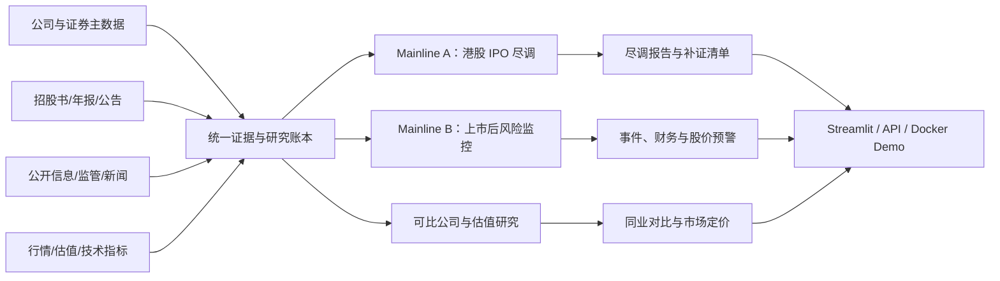
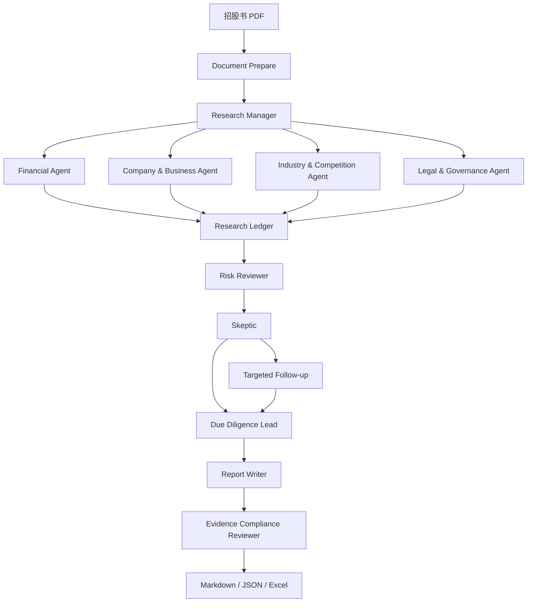

# HK IPO Due Diligence Copilot 产品需求文档

- 文档版本：v1.0
- 产品阶段：Mainline A / MVP 强化期
- 更新日期：2026-08-06
- 当前实现基线：本地 `ipo_financial_agent_full` 工作副本
- 产品边界：上市前公司尽调，不提供投资金额、估值上限、目标收益率或退出期限

## 1. 产品定义

HK IPO Due Diligence Copilot 是一个面向港股 IPO 招股书的证据驱动多 Agent 尽调系统。用户输入公司名称和招股书 PDF，系统模拟投资团队完成公司、股权、业务、行业、财务、法务与负面事项核查，输出可追溯的 Markdown 尽调报告、三大财务报表和补充尽调清单。

产品不是“PDF 摘要器”，也不是直接给出买入价格的股票推荐工具。它解决的是：

1. 过去有没有钱：收入、毛利、利润、现金流、应收、存货、负债和周转质量如何；
2. 未来会不会有钱：公司靠什么赚钱、行业是否增长、客户是否持续、壁垒能否保持、是否存在新产品/新行业/海外拓展；
3. 有没有不能忽视的负面事项：财务真实性、客户集中、关联交易、实控人、诉讼处罚、审计、债务、估值与流动性风险；
4. 看起来异常的事项是否存在合理解释，以及解释是否有原始证据支持。

## 2. 产品愿景与未来版图

长期目标不是继续堆叠互不相连的 Agent，而是形成一个“公司研究操作系统”。



当前只交付 Mainline A。Mainline B 保留接口，不在本期实现。现有本地股票 Agent 的行情、财务、新闻、技术指标和 MCP 数据源，可以在未来重构为 Mainline B 的工具层。

## 3. 目标用户

### 3.1 核心用户

- PE/VC、券商、家族办公室和投资机构的投资经理；
- 需要快速阅读 300–600 页招股书的研究人员；
- 需要形成第一版尽调底稿和补证清单的项目组成员；
- 用于演示金融 Agent 工程能力的 GitHub 和面试用户。

### 3.2 用户不应期待

- 系统替代审计师或律师出具专业意见；
- 系统仅凭招股书自动证明财务造假；
- 系统直接给出投资金额、估值上限或退出期限；
- 系统在没有数据源时生成市场规模、竞争对手或负面新闻。

## 4. 核心使用流程

1. 用户输入公司名称和招股书 PDF；
2. Document Pipeline 只读加载 PDF，保存逐页文本、表格和物理页码；
3. Research Manager 根据公司和文档生成研究任务；
4. 四个专业 Agent 并行研究；
5. 所有专业 Agent 只通过 `Evidence → Finding` 进入统一 Research Ledger；
6. Risk Reviewer 对业务叙述、财务趋势、行业证据和负面线索做交叉核对；
7. Skeptic 对重大冲突或证据缺口提出最多一轮定向补证；
8. Due Diligence Lead 形成三轴尽调判断和 P0/P1/P2 问题；
9. Report Writer 确定性渲染报告；
10. Evidence Compliance Reviewer 检查完整性、引用和范围；
11. 导出 Markdown、JSON、Excel 和 Agent 执行轨迹。

## 5. 当前系统架构



### 5.1 数据层

- `PageData`：物理页码、正文和原始表格；
- `RawStatementTable`：三表原始布局、单位、合并口径和页码；
- `Evidence`：招股书页码、计算轨迹或真实 HTTP(S) URL；
- `Finding`：问题、结论、Evidence ID、证据强度、风险和待核问题；
- `Challenge`：反方 Agent 提出的定向补证任务；
- `DueDiligenceConclusion`：历史财务、未来盈利、重大风险和尽调状态。

### 5.2 Agent 职责边界

| Agent | 核心问题 | 必须输出 | 不应负责 |
|---|---|---|---|
| Research Manager | 这家公司应该查什么 | 公司特定任务、假设、预期证据 | 直接撰写结论 |
| Company & Business | 公司是谁、卖什么、如何赚钱 | 股权、资本事件、产品、客户供应商、运营、子公司管理层 | 行业规模和外部竞争事实 |
| Financial | 过去有没有钱、利润能否变成现金 | 三表、指标、异常、解释、验证材料、升级条件 | 让 LLM 重写财务数字 |
| Industry & Competition | 公司为何能活、未来是否还有空间 | 产业链、客户行业、市场位置、竞争维度、壁垒、增长与拓展 | 重复公司沿革和治理 |
| Legal & Governance | 是否存在负面或治理风险 | 实控人、关联交易、诉讼处罚、许可、审计、债务和舆情线索 | 将搜索摘要直接判成事实 |
| Risk Reviewer | 各 Agent 之间是否自相矛盾 | 矛盾、风险矩阵、解释缺口和核查问题 | 简单统计风险数量 |
| Skeptic | 哪三个问题最可能改变判断 | 有目标、有材料要求的 Challenge | 无限循环研究 |
| Due Diligence Lead | 过去/未来/负面三轴如何判断 | 尽调状态、优势、风险、P0/P1/P2 清单 | 给出投资金额和退出安排 |
| Report Reviewer | 报告是否完整、可追溯、未越界 | 评分、缺失章节、引用问题、修订指令 | 新增未经研究的公司事实 |

## 6. 产品功能需求

### 6.1 P0：主线 A 必须完成

| ID | 需求 | 验收条件 |
|---|---|---|
| FR-P0-01 | 公司名称 + PDF 输入 | Streamlit 和 CLI 均可发起任务；原 PDF 只读 |
| FR-P0-02 | 六类公司业务底稿 | 六个主题均显示内容或明确证据缺口，不能整章空白 |
| FR-P0-03 | 三大财务报表 | 资产负债表、利润表、现金流量表保留单位、期间和页码；完整原表进入附录 |
| FR-P0-04 | 财务指标与法证规则 | Python 计算；规则命中只作为观察，必须给出可能解释、所需证据和升级条件 |
| FR-P0-05 | 行业与竞争 | 至少覆盖产业链、客户行业、竞争维度、壁垒、增长驱动和拓展路径 |
| FR-P0-06 | 公开信息检索 | 行业和法务使用独立预算；保留 URL、来源层级、时间与查询主题 |
| FR-P0-07 | 负面事项核查 | 监管、工商、诉讼、关联方、审计、债务和负面舆情均有状态 |
| FR-P0-08 | 证据链 | 每条进入报告的研究 Finding 引用至少一个已登记 Evidence ID |
| FR-P0-09 | 冲突复核 | 能对增长、毛利、现金流、应收存货和公司解释进行跨 Agent 核对 |
| FR-P0-10 | 最终报告 | 输出十一节机构式报告、三表附录、证据索引和补证清单 |
| FR-P0-11 | 最终审阅 | 检查六个公司子章节、三表、引用和禁止范围；最多一次有界修订 |
| FR-P0-12 | 可演示性 | Streamlit 展示 Agent 轨迹与 Evidence/Finding，并下载 Markdown、Excel、evidence.json 和 agent_trace.json |

### 6.2 P1：GitHub 成熟版

- Dockerfile 与 docker-compose，一条命令启动 API 和 Streamlit；
- FastAPI 任务接口：上传、启动、查询状态、获取报告；
- 任务缓存与断点续跑，避免每次重新解析 500 页 PDF；
- 原始 URL 全文抓取与正文校验，而不仅是搜索摘要；
- 可比公司检索和可配置同业表；
- 页面级证据查看器：点击报告引用定位 PDF 页或外部网页；
- Demo 数据集与脱敏示例报告；
- GitHub Actions：单测、格式、类型检查和最小离线 smoke test；
- 运行成本、Token、耗时、失败原因和 Agent 覆盖率面板。

### 6.3 P2：未来版图

- 年报、公告和问询函增量更新；
- 上市后财务、新闻、行情、估值和技术指标监控；
- 事件与股价异常预警接口；
- 行业模板插件：制造业良率、SaaS 留存、消费品渠道库存、生物医药管线等；
- 历史 IPO 样本评测集和上市后表现回测；
- 团队研究记忆：保留经过人工确认的核查规则、行业术语和材料清单。

## 7. 报告信息架构

1. 投资摘要；
2. 公司基本情况；
3. 股权和治理；
4. 商业模式分析；
5. 行业和竞争；
6. 财务分析；
7. 盈利质量分析；
8. 风险分析；
9. 综合判断；
10. 补充尽调清单；
11. 财务报表附录。

证据索引作为附录A保留；稳定交付文件名为 `IPO_Due_Diligence_Report.md`、`IPO_Due_Diligence_Report.xlsx`、`evidence.json` 和 `agent_trace.json`。

## 8. “侦探式”财务分析规则

系统不得使用“指标低于阈值，因此公司有问题”的单步逻辑。每个异常必须经过以下状态机：

```text
指标异常
  → 观察项 observation
  → 收集可能解释（并购、融资、研发、产品结构、原材料、结算周期等）
  → 要求原始证据和口径桥接
  → 部分解释 / 尚未解释 / 解释矛盾
  → 满足升级条件后才成为重大风险
```

例如毛利率高于 30% 本身不能判差；毛利率下降也可能来自并购业务并表或产品结构变化。真正需要核查的是：解释能否与分部收入、成本、存货、客户、现金流和收购时点相互印证。

## 9. 非功能需求

- 可追溯：事实必须回到 PDF 页码、计算底稿或真实 URL；
- 可复现：同一输入和离线模式应产生稳定结构；
- 不破坏源文件：PDF 永远只读，派生文件写入独立目录；
- 可降级：模型或搜索不可用时保留缺口，不生成假数据；
- 可审计：保存 Agent 输入、输出、工具调用、Evidence 和 Reviewer 结果；
- 可配置成本：模型、搜索源、查询预算和最大页面数可通过环境变量控制；
- 安全：模型权重、密钥、客户 PDF 和未脱敏报告不进入公开 Git 仓库。

## 10. 质量指标

| 指标 | MVP 目标 |
|---|---:|
| 必需章节覆盖率 | 100% |
| 三表存在率 | 100%，无法抽取时必须明确失败原因 |
| Finding 引用有效率 | 100% |
| 外部事实真实 URL 比例 | 100% |
| 无来源数字进入最终结论 | 0 条 |
| 公司特定硬编码 | 0 处 |
| 财务表由 LLM 改写 | 0 次 |
| 单元测试 | 全部通过 |
| 终审 | 无范围违规、无失效 Evidence 引用 |

质量评估不能只看 Reviewer 分数。还应人工抽查：页码是否准确、数字口径是否一致、主体关系是否正确、外部摘要是否被错误升级为事实、异常解释是否形成闭环。

## 11. 当前阶段评估

### 11.1 已具备

- 完整 LangGraph 多 Agent 工作流和顺序降级方案；
- PDF 逐页解析、三表还原、财务事实、指标和法证规则；
- 统一 Research Ledger、Evidence 校验和 Agent 消息轨迹；
- 公司、行业、财务、法务四个专业分支；
- Risk Reviewer、Skeptic、定向补证、主笔和终审；
- Streamlit 页面、CLI、Markdown/JSON/Excel 导出；
- 本地工作副本 22 个测试文件、68 个测试函数；
- README 和架构文档。

### 11.2 仍未达到“可自豪展示”的部分

- 本轮 Agent 增强尚未完成远端同步和真实 Qwen 端到端回归；
- 外部搜索目前主要是可追溯摘要，缺少自动打开原文和全文校验；
- 公司与行业内容质量仍依赖小模型，缺少黄金样本评测；
- 没有 Docker 和正式 API；
- 没有公开脱敏 Demo、截图、演示视频和在线部署；
- 缺少多公司批量回归，尚不能证明普适性；
- 仓库内存在 `.bak` / `before_*` 历史文件，发布前需要清理；
- 当前 PDF 解析仍是自研链路，扫描件和复杂无框表是已知风险。

## 12. 与本地股票投资顾问 Agent 的对比

对比对象：

- 当前项目：`ipo_financial_agent_full`；
- 股票项目：`Financial-MCP-Agent` + `a-share-mcp-is-just-i-need`；
- 比较依据为本地代码，而不是只看项目描述。

`Finance` 目录中的 `nasdaq_news_sentiment` 和 `risk_nasdaq` 目前是独立 Notebook/CSV 实验，尚未接入 `Financial-MCP-Agent` 的 LangGraph 主流程，因此不计作已交付的多 Agent 能力。

| 维度 | 港股 IPO 尽调 Agent | 本地股票 Agent | 当前领先方 |
|---|---|---|---|
| 产品定位 | 上市前、机构式深度尽调，范围清晰 | A 股综合投资顾问，覆盖基本面/技术/估值/新闻 | IPO 更聚焦；股票更大众 |
| Agent 形态 | Planner + 4 专业 Agent + Reviewer + Skeptic + Lead + Final Reviewer | 4 个 ReAct Agent 并行 + 1 个 Summary Agent | IPO |
| 动态工具调用 | 专业工具多由管线确定调用，Agent 自主性受控 | 每个 Agent 可自主选择 MCP 工具 | 股票 Agent |
| 数据工具广度 | PDF、财务计算、搜索、证据存储 | Baostock、K 线、财报、宏观、指数、新闻、情感/风险模型 | 股票 Agent |
| 财务尽调深度 | 三表原表、单位/口径/页码、指标与解释状态 | MCP 返回财务数据后由 LLM 生成文本分析 | IPO |
| 公司业务/股权 | 六类专门底稿 | 基本面 Agent 的一个提示词部分 | IPO |
| 行业竞争 | 产业链、客户行业、壁垒、增长与拓展；来源分级 | 主要依赖基本面 Agent 自主查询 | IPO |
| 新闻和行情时效性 | 当前较弱，搜索仍需全文核验 | 新闻爬取、情感、行情、技术指标较完整 | 股票 Agent |
| 证据可追溯 | Evidence ID + PDF 页码 + URL + 校验 | Agent 最终主要保存自由文本，缺少统一引用契约 | IPO |
| 跨 Agent 冲突 | 有结构化矛盾、风险矩阵和补证回路 | Summary 通过提示词总结一致点/分歧，无验证回路 | IPO |
| 最终审阅 | 有确定性终审和一次有界修订 | 无独立 Reviewer | IPO |
| 输出 | Markdown、JSON、Excel、证据索引、Agent 轨迹 | Markdown 报告和较完整执行日志 | IPO 略强 |
| 前端展示 | 已有 Streamlit | CLI | IPO |
| 测试 | 22 个测试文件、68 个测试函数 | Agent 主项目仅 1 个提取测试；MCP 项目未见正式测试函数 | IPO |
| 可移植性 | 环境变量配置，仍待 Docker | MCP 路径和本地模型路径硬编码为 `/root/code/Finance/...` | IPO |
| 代码简洁性 | 架构完整但文件较多，存在历史备份文件 | Agent 文件大量重复模板和超长函数 | 两者都需整理 |
| 即时 Demo 感 | 报告专业，但真实内容质量仍待 Qwen 回归 | ReAct + MCP 调用行情新闻，演示更“会动” | 股票 Agent |
| 简历差异化 | 港股 IPO、证据链、财务取证、审计式 Reviewer，辨识度高 | 常见股票分析 Agent，功能直观但同质化较强 | IPO |

### 12.1 结论

若评价“机构尽调、工程可信度和 GitHub 差异化”，当前 IPO 项目更好；若评价“工具调用的灵活性、实时行情新闻和第一眼 Agent 感”，股票 Agent 更好。

IPO 项目现在不是全面碾压：它的架构和测试已经领先，但真实报告内容、公开信息全文验证、部署和演示包装还没有追上架构。股票 Agent 则相反：工具层丰富、运行观感好，但协作实际上是简单 fan-out/fan-in，各 Agent 产物是自由文本，缺少统一证据、冲突验证和最终审阅。

正确路线不是把两个项目机械合并，而是：

1. 保留 IPO 项目的 Research Ledger、财务确定性计算、Reviewer 和报告架构；
2. 抽取股票项目的 MCP 数据源接口、行情、新闻和技术指标能力；
3. 将这些工具作为未来 Mainline B 和可比公司模块接入统一 Evidence 契约；
4. 不复用股票 Agent 的自由文本汇总方式和硬编码部署路径。

## 13. 里程碑与路线图

### M0：可靠闭环（当前，优先完成）

- 将本轮本地 Agent 改造同步远端；
- 运行完整测试和真实 Qwen 招股书回归；
- 对报告逐章人工验收，修复内容断链；
- 用至少 3 家不同行业公司验证普适性；
- 清理样本页码、公司硬编码和历史备份文件。

退出条件：同一套代码可以对 3 家公司生成完整报告，所有事实可回溯，空章节有明确原因。

### M1：内容质量与公开信息（下一阶段）

- 增加原始 URL 打开、正文抽取和主体/日期校验；
- 建立公司业务、行业和法务的黄金问题集；
- 增加并购口径、客户集中、供应商返利、研发资本化、商誉和债务等解释模板；
- 建立人工评分表：完整性、准确性、洞察、引用和可行动性。

退出条件：外部结论可回到原文；财务异常能呈现解释链，而不是只有规则名称。

### M2：产品化和 GitHub 展示

- FastAPI、Docker、任务状态和缓存；
- Streamlit 页面升级为上传、执行轨迹、证据查看和报告下载四个区域；
- 提供脱敏 Demo PDF、示例输出、架构图、截图和 2–3 分钟演示视频；
- GitHub Actions、安装说明、成本说明和限制说明。

退出条件：陌生用户根据 README 可在 10 分钟内运行离线 Demo；无模型权重也能理解和检查项目。

### M3：Mainline B 接口

- 将本地股票 Agent 的 MCP 数据源重构为可插拔 Provider；
- 接入上市后行情、公告、新闻、估值和技术指标；
- 只定义风险事件和特征接口，不在 Mainline A 阶段训练股价预测模型。

退出条件：IPO 公司上市后可沿用同一公司实体和 Evidence Ledger 接收增量数据。

## 14. 发布前决策门槛

项目只有同时满足以下条件，才建议作为简历主项目公开：

1. 至少三家不同类型公司的端到端报告；
2. 一份经过人工逐页核对的黄金报告；
3. 无公司特定硬编码、无假 URL、无 LLM 改写三表数字；
4. README 能讲清楚为什么是多 Agent，而不是多个 Prompt；
5. 演示能展示一次真实冲突或解释核查闭环；
6. Docker 或明确可复现环境；
7. 公共仓库不包含模型权重、密钥和客户敏感材料。

## 15. 产品一句话介绍

> 一个面向港股 IPO 的证据驱动多 Agent 尽调系统：从 500 页招股书还原三大财务报表，协同分析公司、行业、财务和治理风险，并通过反方质疑和证据终审生成可追溯的机构式尽调报告。
