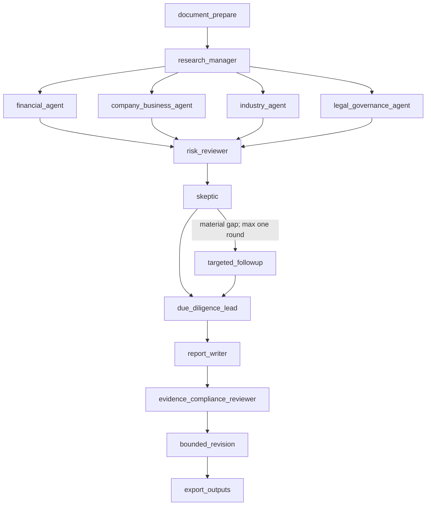

# Architecture

## Design goals

The system optimizes for traceability, deterministic financial calculations, bounded agent autonomy, source-aware public research, and graceful offline operation. An Agent may interpret evidence; it may not invent a source, replace a Python calculation, or regenerate financial tables.

## Layers

### 1. Document layer

- `pages.json` stores physical page numbers, text, and raw tables.
- `raw_statements.json` preserves detected layouts, labels, units, scope, and row provenance.
- The input PDF is read-only. Scanned documents require an OCR pre-step.

### 2. Deterministic financial tool layer

`FinancialAgent` orchestrates raw-statement extraction, canonical fact mapping, metric calculation, six baseline risk rules, and twenty forensic rules. Every metric retains source facts and pages. The final Markdown renders the primary consolidated balance sheet, income statement, and cash-flow statement directly from `RawStatementTable`; LLM output is never accepted as a replacement for those figures.

### 3. Evidence layer

- `Evidence`: PDF page, calculation trace, or real HTTP(S) URL.
- `Finding`: a conclusion plus one or more known Evidence IDs.
- `Challenge`: a bounded request for counter-evidence or missing material.
- `ResearchPatch`: append-only output from each specialist.
- `EvidenceStore`: deduplication and reference validation.

Search snippets use `verification_status=search_lead_requires_source_review`. They are discoverability evidence, not proof of the underlying claim.

### 4. Agent collaboration layer

LangGraph fans out the four specialist branches. The sequential fallback uses identical node contracts. `agent_messages` records delegation, findings, challenges, decisions, writing, and review.

The writer is hybrid: deterministic rendering is authoritative; short narrative drafts may be polished by the configured model. A long report containing financial tables bypasses full LLM regeneration to prevent latency, truncation, or changed figures.

### 5. Review layer

The final reviewer checks:

1. mandatory company, industry, financial, future-earning, legal, conflict, and conclusion sections;
2. six company/business subsections plus balance sheet, income statement, and cash-flow statement presence;
3. Evidence IDs, prospectus pages, or URLs;
4. unsupported claims and investment-scope violations;
5. one bounded revision without adding new facts.

Deterministic issues are authoritative. LLM scores are recalculated from the structured issue ledger so internally inconsistent model output cannot mark a broken report as perfect.

## External research

`SearchService` is provider-based and budgeted. The query planner covers twelve themes. Industry/competition and legal/governance use independent query budgets, so P0 regulatory checks cannot consume the cap before industry, competitor, customer/supplier, and policy research runs. URLs are deduplicated and graded as official, primary, or secondary.

- Tavily is selected when a key is configured.
- DDGS is an opt-in, no-key fallback capped at three themes because cloud IPs are frequently throttled.
- Missing providers return an empty result; no mock result or placeholder URL enters the ledger.

Industry, competitor, customer/supplier, and policy leads are routed to the industry report. Filing, regulatory, registry, litigation, controller, financing, audit, and adverse-media leads are routed to legal/governance. Every lead remains open until the original URL is reviewed.

## Traceability invariants

1. A prospectus Evidence item references an actual input page.
2. A web Evidence item contains a real HTTP(S) URL.
3. A Finding cites at least one known Evidence ID.
4. A computed metric retains source fact IDs and pages.
5. Missing evidence remains an open question or unresolved challenge.
6. Financial tables are rendered from extracted document objects, never invented by an LLM.
7. No production rule contains a company name, sample-specific page number, or sample conclusion.

## Known failure modes

- OCR, complex borderless tables, merged cells, and mixed reporting periods may need manual correction.
- Canonical mapping can confuse similarly named line items.
- Public search engines may throttle GPU-cloud IPs.
- Search results require full-text verification and document-version awareness.
- A small local model may produce malformed structured output; all LLM stages have deterministic fallbacks.
